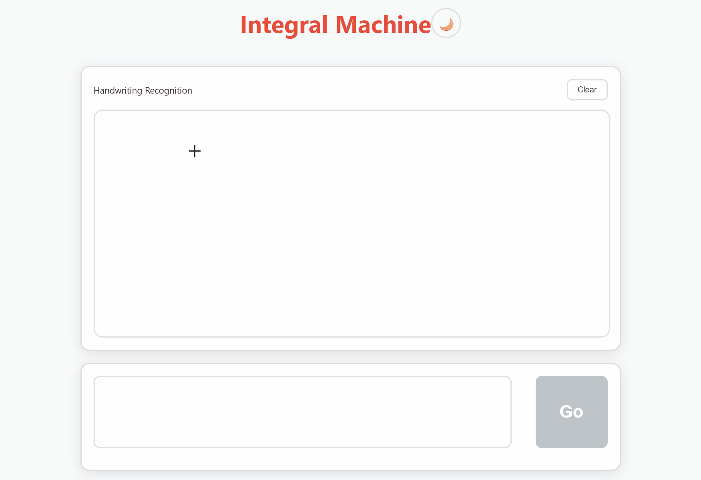
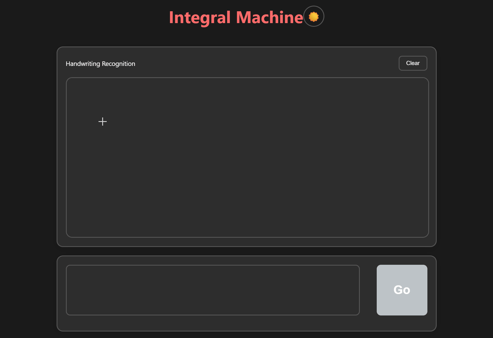

# Integral Machine
## Introduction:
Integral Machine is a system that recognizes mathematical expressions from images and performs integral operations.<br>
It is powered by a front-end interface and a back-end server powered by a trained BTTR model. This system processes handwritten mathematical expressions through image recognition and performs step-by-step symbolic integration calculations.
## Function
1.Recognize handwritten or printed math expressions from images and convert them to LaTeX using a trained BTTR model.<br>
2.Use SymPy for symbolic integration,aotomatic integration. Frontend for uploading images and viewing results, backend for image recognition and computation.
## Demonstration


## Setup:
### Backend:
Create a new environment:
```
python -m venv venv
.\venv\Scripts\activate
pip install -r requirements.txt
```
### Frontend:
Install nvm:<br>
For MacOS:<br>
Please refer to https://github.com/nvm-sh/nvm<br>
For Windows:<br>
Download and install https://github.com/coreybutler/nvm-windows<br>
Then run:
```
nvm install 21
uvm use 21
```
## How to Run:
### Backend:
Run in venv:
```
uvicorn app.main:app --reload --port 8000
```
Backend loading is successful and displayed:
```
INFO: Application startup complete.
```
### Frontend:
At the root of the project, run:
```
cd ./integral-machine/
npm run dev
```
Front-end loading is complete and has been displayed.
```
VITE v6.*.*  ready in *** ms
```
Then open the webpage in any browser, have fun!